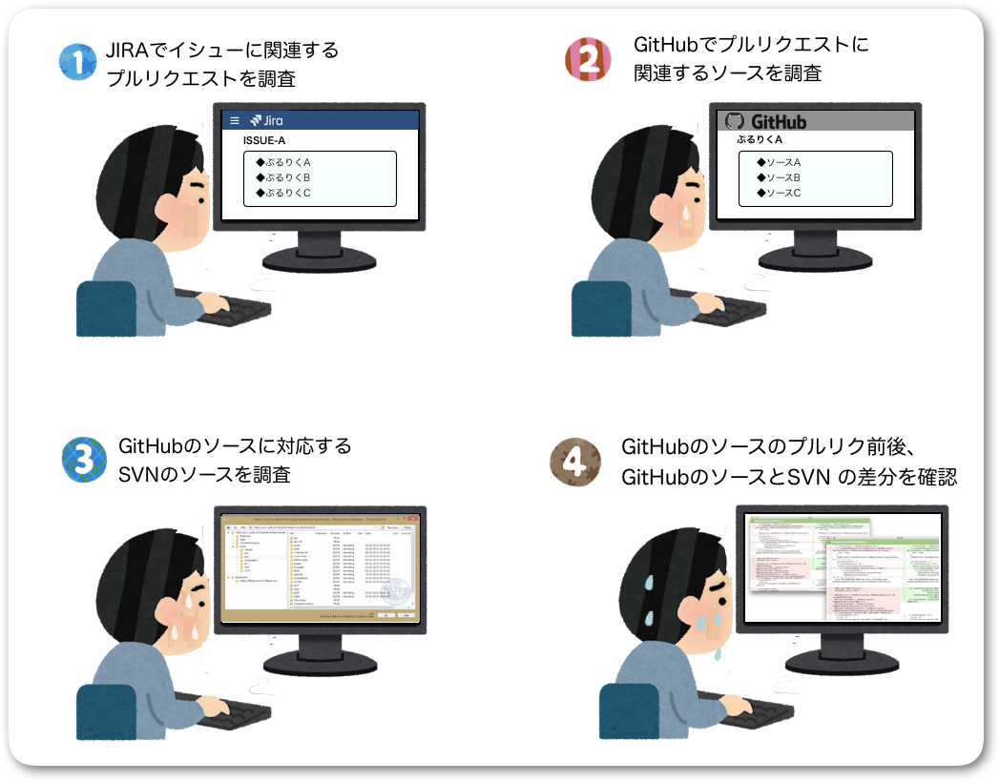

# jira-pullrequest-getter
こんな作業を自動化します。




## シーケンス図


## 起動方法

- 依存ライブラリインストール

  ```
  $ npm install
  ```

- .env ファイル作成
  プロジェクトルート配下に`.env`ファイルを作成

  ```
  JIRA_BASE_URL = "https://XXXXX"
  JIRA_USERNAME = "XXXXX"
  JIRA_PASSWORD = "XXXXX"
  JIRA_ISSUES = "XXXX,XXXX,XXXX"
  SVN_ROPOSITORY_URLS = "https://XXXXX,https://YYYYY,https://ZZZZZ"
  SVN_USERNAME = "XXXXX"
  SVN_PASSWORD = "XXXXX"
  GITHUB_TOKEN = "XXXXX"
  ```

- 実行

  ```
  $ npm start
  ```

## 環境設定

ソースを VSCode で編集する場合は下記を基本設定に追加（保存時にフォーマットしてくれるようになる）

```
{
  ・・・
  "editor.formatOnSave": true,
  "prettier.eslintIntegration": true,
  ・・・
}
```

## 注意事項

[GitHub API の回数制限](https://developer.github.com/v3/#rate-limiting)に注意
